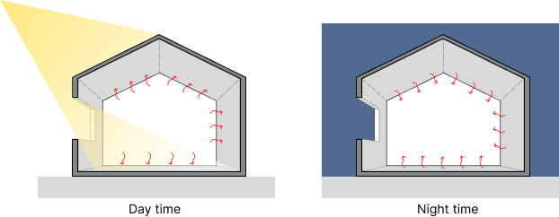
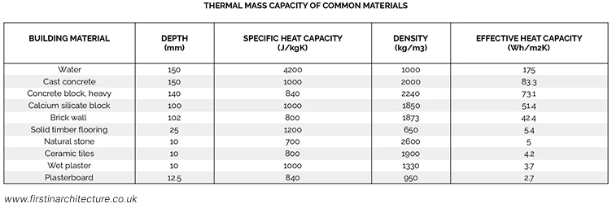
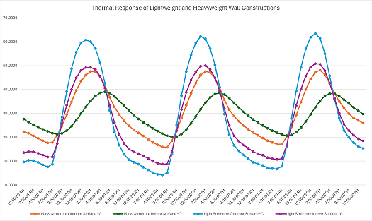
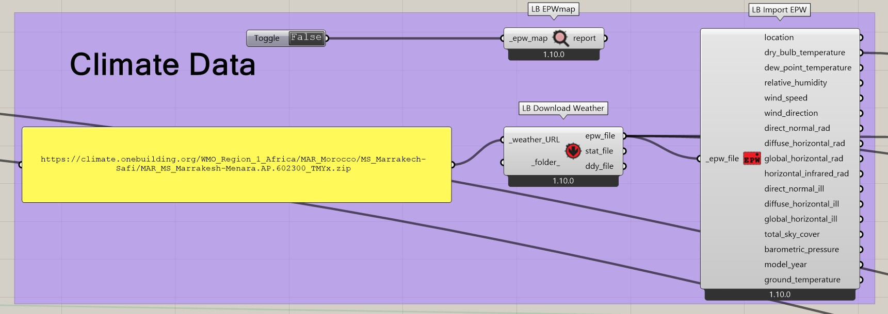
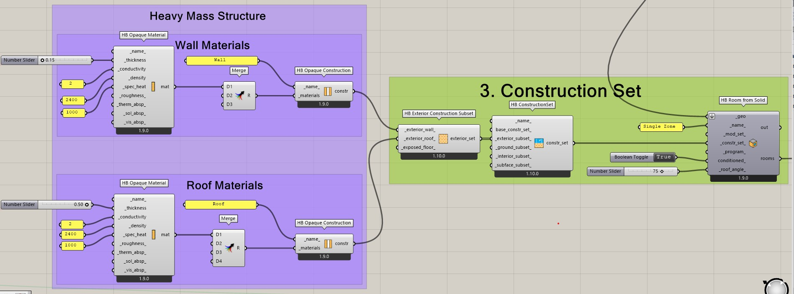
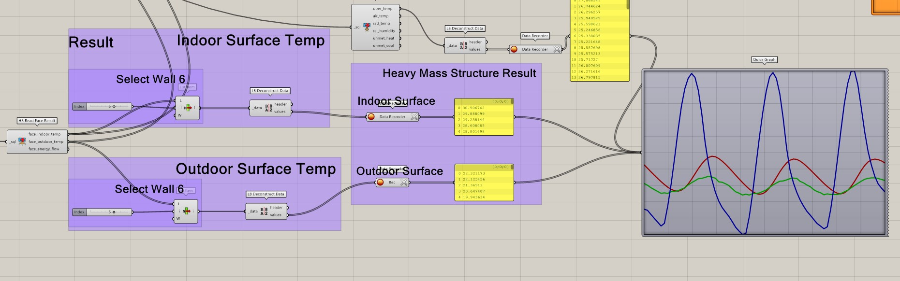
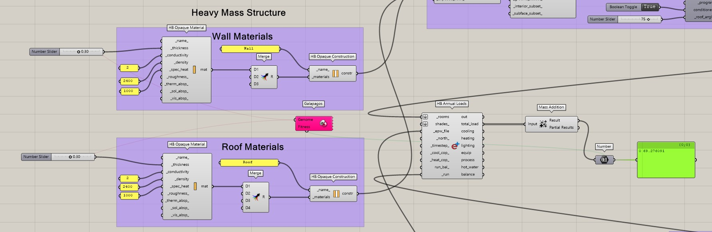

# Effect of Thernal Mass
Thermal mass describes a materials ability to store heat from surrounding air or surfaces.

Generally speaking, the denser the material, the better the thermal capacity.

### Daytime heat absorption  
During a warm summer day, thermal mass absorbs and stores heat, and delay heat transfer to the interior and reduce short-term indoor temperature fluctuations.

### Nighttime cooling
The heat is absorbed during the day and released at night. In winter, thermal mass can also store useful heat from solar gains, occupants, and appliances, releasing it later as indoor temperatures fall.

### Materials
Keep thermal mass materials as exposed as possible.

### Thermal lag
Thermal mass delay is the time it takes for heat to travel through a heavy building material like concrete, brick, or stone from the outside surface to the inside surface.

### The time delay
This stored energy moves slowly through the material, delaying peak indoor temperatures by 6 to 12 hours.

### Temperature damping
Heavy mass also flattens temperature swings, turning a harsh 20-degree outdoor swing into a mild indoor change. This dampening effect is measured by the decrement factor.

### Experiments

1. Create a simple model  
  
2. Choose Climate Data in Hot-Arid Climate Zone  
  
3. Try different materials properties, thickness, layers, in-out insulation and connect to Construction Set...
  
4. Creat a HB Model with aperture and setting up the HB Simulation

5. Test the result to see the delay effect of the materials
   
6. Furthermore, try to run Galapagos to optimize the thickness of walls, roof...
  

[name](Thermal Mass Experiment.gh)
